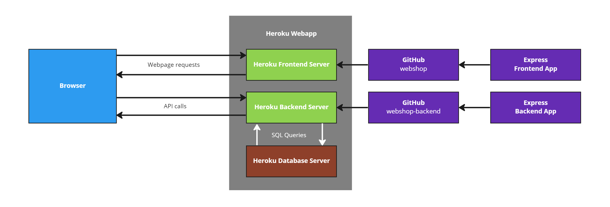
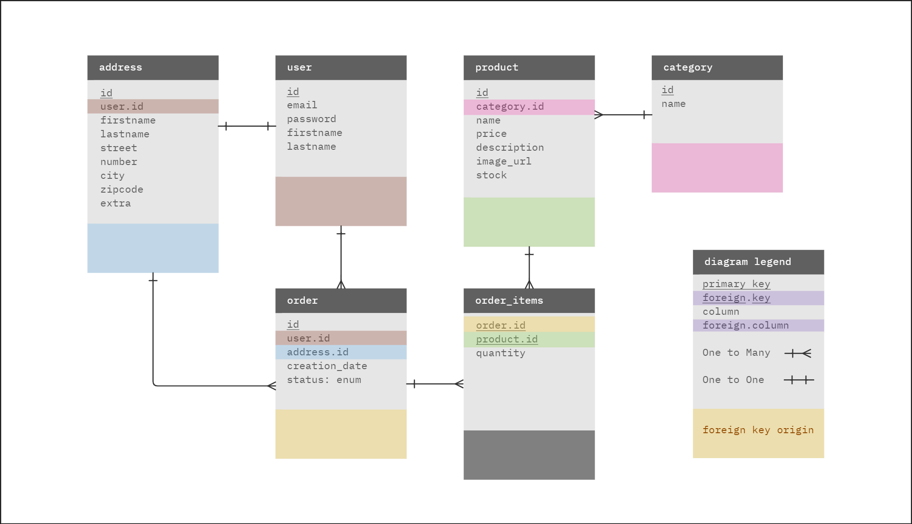

# Webshop project - backend

This is a simple webshop application that is meant to be a learning project to gain more knowledge in both Front- and Backend development.

## Setting the project up locally

1. Clone both the [frontend](https://github.com/niklas-jacobsen/webshop) and [backend](https://github.com/niklas-jacobsen/webshop-backend) repositories.
2. Set up the frontend server as explained in the [frontend README](https://github.com/niklas-jacobsen/webshop/blob/main/README.md)

3. Set up a local postgres database

4. Create a .env file and write into it:

```sh
DATABASE_HOST=localhost
DATABASE_PORT=5432
DATABASE_USER=
DATABASE_PASSWORD=
DATABASE_DATABASE=webshop
SECRET_KEY=_Your secret key goes here_
ISLOCAL=true
```

5. run `npm install` to install all necessary dependencies.

6. run `npm run dev` to start the backend express server.

## Documentation

The frontend, backend and the postgres database of this project have all been deployed on Heroku.



### Techstack

- TypeScript
- NodeJS
- Express
- Postgres
- TypeORM

This Techstack was chosen based on what was recommended to me and also what I felt most comfortable using.
With this being my first Full stack project, TypeScript was used whenever possible to ensure typesafety of all variables.
When ideating the project, it became clear early on that a relational database would make to most sense for a webshop.
I chose TypeORM as an ORM because the parameterized queries made it easy to use in the backend.

### Database



In the model above colors indicate foreign values and the table they originate from. The original table is also written in their name before the (`.`)dot. Primary keys, foreign or not, are underlined.

The database schema was designed to be in 3NF as there are only atomic values, every non-key-attribute is fully functional dependent on the primary key(s) and there are no transition dependencies.

### Authentication

The following requests can only be made with authentication:

- `/user/me`
- `/user/:id`
- `/address/me`

A middleware is used (`auth.ts`) which checks for an auth token in the header of a request. If found, the content of the token and the associated user ID are sent to the request origin.

#### Register

On account creation, the users chosen password gets hashed using [bcrypt](https://www.npmjs.com/package/bcrypt) and is then stored in the database together with the salt and the saltRounds.

#### Login

When logging in, bcrypt compares the entered password with the hash in the database. When they match a [jwt token](https://www.npmjs.com/package/jsonwebtoken) is sent to the frontend and stored in a cookie.
